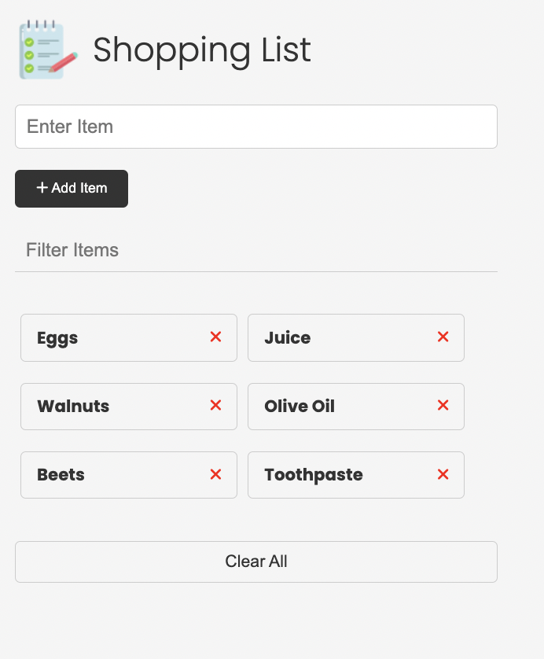

# Shopping List 

## Table of Contents

1. [Description](#description)
2. [Installation](#installation)
3. [Usage](#usage)
4. [Screenshot](#screenshot)
5. [Testing](#testing)
6. [Contributors](#contributors)
7. [License](#license)
8. [Questions](#questions)

## Description 
    
This is a vanilla JS app designed to manage your shopping needs
    
## Installation 
    
No installation necessary, simply navigate to: https://sunny-heliotrope-aee3ce.netlify.app/

## Usage 
    
Enter an item in the input and click the 'Add Item' button. You can also edit or remove saved items.    

## Screenshot 

## Testing 

Try out all the functionality!

## Contributors 
    
This is an exercise from Brad Traversy's 'Modern JS: From the Beginning' course. He provided the starter HTML and CSS.

## License 
    
This is a vanilla JS app designed to manage your shopping needs

## Questions 

Philip Scott Neumann

https://github.com/moviefan322

philman202@yahoo.com
    